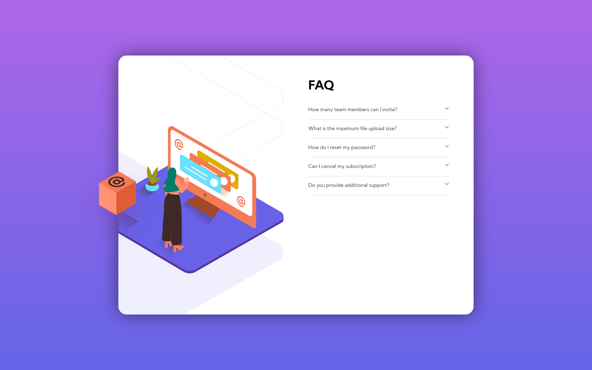

# FAQ Accordion Card

## Welcome! 👋

Thanks for checking out this front-end coding challenge. This accordian card was made with help of HTML, CSS, and a little bit of javascript. For javascript portion I have opted for JQuery. No CSS library is used. 

Looking forward for feedback

**To do this challenge, you need a basic understanding of HTML, CSS and JavaScript.**

